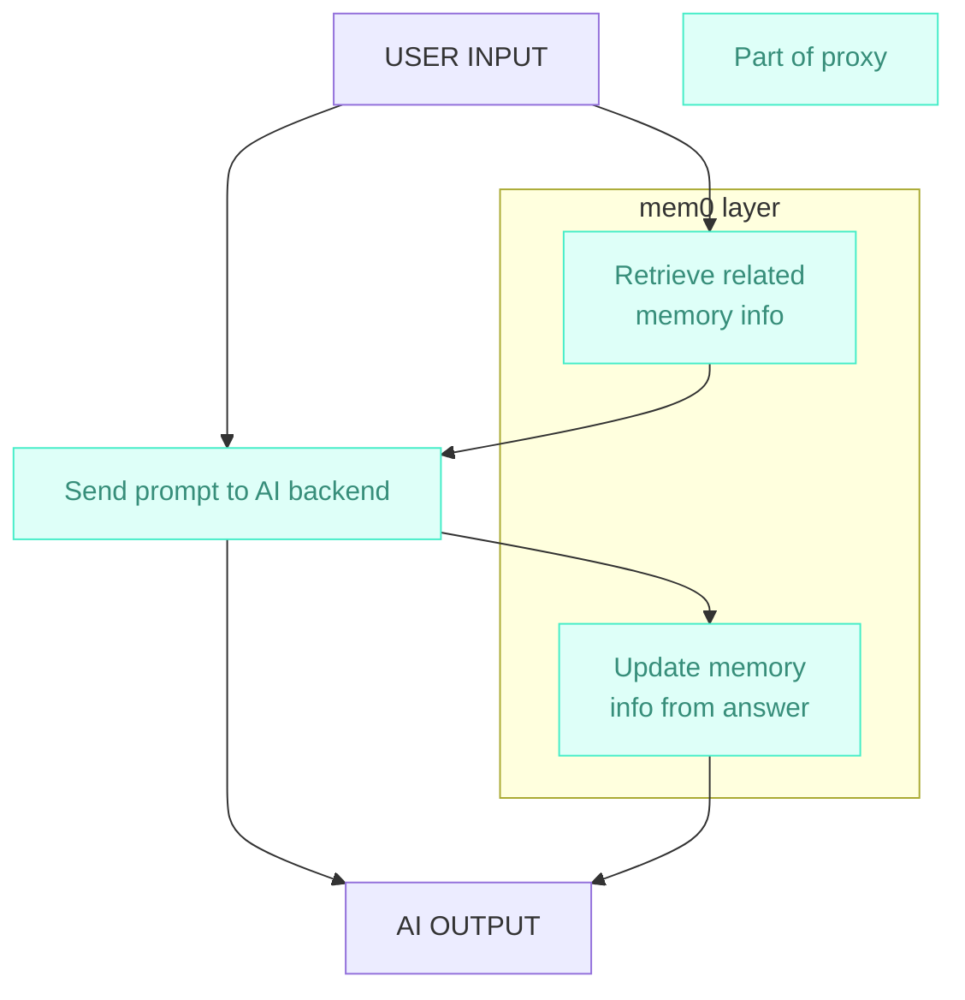

# chatgpt clone

so i want to self host all of my ai stuff cuz i dont wanna rely on internet blah
blah blah. the entire mission statement of the homelab is that i have a local
network that i can use to do all of my everything computation and not need to
rely on the external internet, and i use chatgpt for misc stuff quite often, so
i wanna self host chatgpt as well.

this shouldnt be too hard with off the shelf solutions, like localai, open
webui, etc. i can get like 90% there on the software side with just off the
shelf solutions. but one of the features that i have grown quite fond of from
chatgpt is the memory functionality. i like being able to persist information
across chat sessions without needing to explicitly tell it to memorize stuff.

localai has a sister product called localrecall, but that seems like more
document rag than any sort of memory functionality. instead, i found mem0, a
memory layer that advertises better stats than even openai's system. faster
retrieval and better results according to mem0. the only issue is that mem0 is
not a drop in service that i can just run in my homelab.

so i think my plan is to build an llm/ai proxy. this will give me the most
flexibility with what i can do and how the ai works in my setup. for example, i
can use whatever llm backend i want, like localai, llama.cpp, vllm, or whatever
else, and inject memory into all of them, and whatever other metrics and tracing
and all of that.

effectively, what we get is a generic openai api. this uses the model specified
to choose how to handle the request. if it should just send the request to the
ai backend, the request is just proxied. but if it should include memory, it
injects the memory bits into the request. so in the beginning, it queries mem0
for any relevant memory info and injects that as a prompt into the chat. it then
sends the chat to the ai backend and when it gets something back out, it sends
that back to mem0 to update, add, or remove memories and returns out the output.

i feel like it shouldnt be too hard and we'll see what the results end up
looking like. im interested to know how openai does this because it feels like
if i just inject memory info at the end of a prompt, that wouldnt be ideal, but
i guess it might work fine. i just dont really want it to interfere with the
flow of the conversation. it should be completely opaque to me as the user and
it should provide quite good multi-session memory so that it can learn about me
and my projects and whatever else over time so that i can refer to things ive
already told it and not have to go through the whole rigmarole in every single
chat.

it should also make it easier for me to like test out different inference
backends and all that and also inject like logging and metrics and whatever else
i want for my ai stuff

## status

current stage: idea
